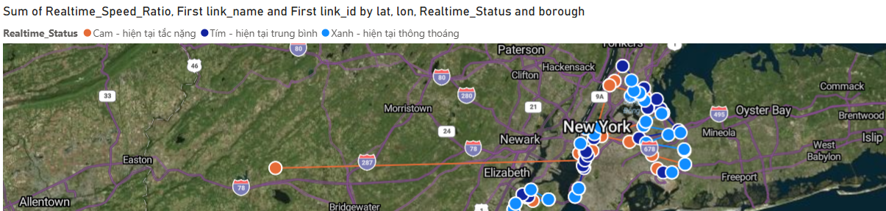
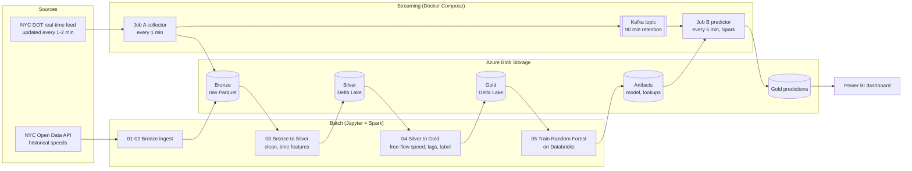
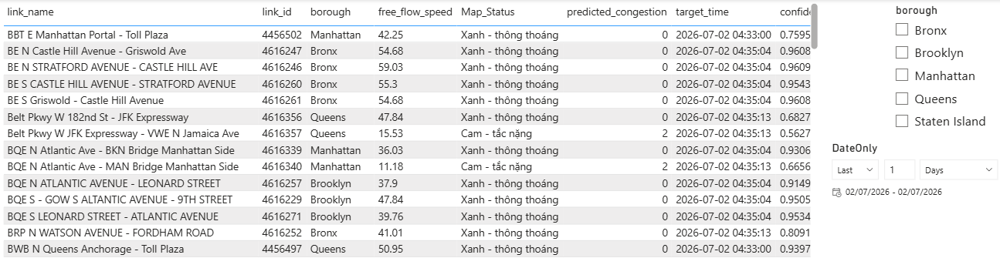
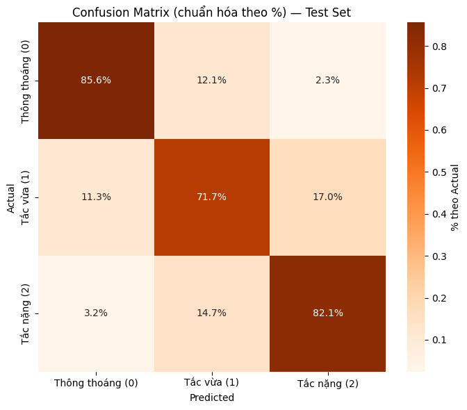

# NYC Traffic Lakehouse

Predicts the traffic congestion level 15 minutes ahead for 116 road segments in New York City, using a streaming pipeline and a lakehouse built on Kafka, Spark and Delta Lake.

This is a course project for Big Data Processing at HCM-UTE (team of 3, 2026). Historical data comes from NYC Open Data and live data from the NYC DOT real-time traffic speed feed. The full report is in Vietnamese: [Nhom01_BaoCao_Final.pdf](Nhom01_BaoCao_Final.pdf).



## Overview

- Collected 30 months of historical speed data (01/2024 to 06/2026) from the NYC Open Data API and processed it with Spark into Bronze, Silver and Gold layers stored as Parquet and Delta Lake on Azure Blob Storage. The Silver layer has 23.5M cleaned records.
- Built 19 features per road segment: current speed ratio, congestion level 15 to 60 minutes earlier, short-term trend, time of day, day of week and holidays. Lag features are only kept when the real time gap matches the expected one (within 5 minutes).
- Trained a Spark MLlib Random Forest to classify congestion 15 minutes ahead into 3 classes. With a time-based split (train 01/2024 to 09/2025, test 01/2026 to 06/2026), it reaches a macro F1 of 0.77 on 1.34M test records.
- Built the real-time side with two Python services: Job A reads the live feed every minute and publishes to Kafka, Job B reads the last 90 minutes from Kafka every 5 minutes, rebuilds the same features and writes predictions to the Gold layer.
- Packaged Kafka, a Spark cluster and both jobs with Docker Compose, and built a Power BI dashboard on top of the Gold layer.

## Architecture



## Data

| Source | Used for | Notes |
|---|---|---|
| [DOT Traffic Speeds](https://data.cityofnewyork.us/d/i4gi-tjb9) (NYC Open Data) | Training | Pulled month by month through the Socrata API with paging, about 1M rows per month |
| [Real-time traffic speed feed](https://linkdata.nyctmc.org/data/LinkSpeedQuery.txt) (NYC DOT) | Prediction | TSV file, refreshed every 1 to 2 minutes |

Both sources come from the same sensors and use the same `link_id` for each road segment. We only kept the 125 segments that were still active in the live feed, and 9 of them had no valid speed at all, so 116 segments are used for training and prediction.

A copy of the data we collected is on [Google Drive](https://drive.google.com/drive/folders/16yXYw4kNDw1v950dqq1R548BGgVQr_9z?usp=sharing): the full historical Bronze data as CSV, a one-month sample, and the files we stored on Azure Blob Storage.

## How it works

### Lakehouse layers

| Layer | Content |
|---|---|
| Bronze | Raw monthly Parquet files from the API, plus raw snapshots saved by Job A |
| Silver | Records with 0 < speed < 100 mph for active segments, with hour, day of week, month, weekend and NY holiday flags (Delta Lake, partitioned by year and month) |
| Gold | 19 features and the label for training (21.9M rows), and the prediction results from Job B |

### Congestion label

Free-flow speed is the 85th percentile of speed for each segment, computed on the training period only to avoid leakage. The speed ratio is current speed divided by free-flow speed:

| Class | Speed ratio | Meaning |
|---|---|---|
| 0 | 0.67 or more | Free flow |
| 1 | 0.40 to 0.67 | Moderate congestion |
| 2 | below 0.40 | Heavy congestion |

The thresholds follow the level of service boundaries in the Highway Capacity Manual (HCM 2010). The target is the class of the same segment 15 minutes later.

### Real-time prediction

- **Job A** (every minute): reads the live feed, drops inactive segments, stale readings (older than 120 minutes), invalid speeds and unchanged readings, computes the speed ratio and class, and sends one message per segment to Kafka (key = `link_id`). If Kafka has data for fewer than 20 segments after a restart, it reloads the last 90 minutes from Bronze so Job B can predict right away.
- **Job B** (every 5 minutes): reads the last 90 minutes of messages from Kafka, finds the readings closest to 15, 30, 45 and 60 minutes ago (within 5 minutes, or the last value up to 15 minutes old), and skips a segment if any lag is missing. It then runs the saved Spark pipeline and writes the predicted class and its probability to the Gold layer.



The model was trained on Databricks (Spark 4.1) but Job B runs Spark 4.0, which could not load the saved Random Forest because the tree metadata file had unnamed columns. `notebooks/fix_model_load.ipynb` renames the columns with PyArrow, tests the fix on a copy of the model, then applies it to the original.

## Results

Test set: 01/2026 to 06/2026, data never seen during training. Validation: 10/2025 to 12/2025.

| Set | Rows | Macro F1 | F1 free flow | F1 moderate | F1 heavy |
|---|---|---|---|---|---|
| Validation | 796,008 | 0.761 | 0.908 | 0.583 | 0.793 |
| Test | 1,337,237 | 0.767 | 0.905 | 0.592 | 0.805 |



The moderate class is the hardest because it sits between the two thresholds and is often confused with both neighbors (precision 0.50, recall 0.72).

Most important features: speed ratio (0.31), current class (0.20), speed ratio 15 minutes ago (0.13), class 15 minutes ago (0.11). Calendar features have very low importance.

### Model setup

| Setting | Value |
|---|---|
| Model | Spark MLlib RandomForestClassifier, 80 trees, max depth 12, min 5 rows per node |
| Inputs | `link_id` and borough (StringIndexer), 17 numeric features |
| Class imbalance | Inverse frequency class weights (free flow is about 70% of the data) |
| Data | Stratified 35% sample of the Gold layer (7.7M rows), split by time |
| Training time | About 53 minutes on Databricks Serverless |

## Limitations

- **Timezone bug in the training data.** Notebook 03 treats `data_as_of` from the historical API as UTC and converts it to New York time. A later check showed that the API already returns New York local time: an archived copy of the live feed from 2026-06-08 08:13 (New York time) matches the API records at 08:14 for the same segments and speeds. So hour, day of week, weekend and holiday features in the training data are shifted 4 to 5 hours earlier, while Job A and Job B use the correct time. Lag features and labels are not affected, and calendar features have very low importance in the model, so the reported F1 is still valid. The fix is to remove `from_utc_timestamp` in notebook 03 and rerun notebooks 03 to 05.
- There is no simple baseline in the evaluation, such as predicting that the class 15 minutes later is the same as now. Since the current class is strongly correlated with the label (0.85), this baseline is likely strong, and the gain of the model over it is not measured yet.
- Hyperparameters were not tuned. We planned a grid search but trained one fixed configuration on a 35% sample because of compute limits.
- Job B starts a Spark session to score about 100 rows every 5 minutes. This keeps the same pipeline as training but is heavier than needed.
- The map uses the first point of each segment's `link_points` from the API. For one segment (4616223, Gowanus Expressway N) that point has a typo in the source data (longitude -74.841 instead of about -74.001), so it shows up in New Jersey on the map. Using the median point of the segment would avoid this. It only affects the map, not the model.
- Only 116 segments have usable data. Segments added later need new history, a new free-flow lookup and retraining.
- The NYC APIs may block requests from outside the US. We used a VPN when running from Vietnam.

## Tech stack

Python, Apache Spark 4.0 (PySpark, Spark MLlib), Delta Lake, Apache Kafka 4 (KRaft), Docker Compose, Azure Blob Storage, Databricks, APScheduler, confluent-kafka, pandas, PyArrow, Power BI

## Project structure

```
NYCTraffic_Lakehouse/
├── docker-compose.yml        # Kafka, Spark master + worker, Job A, Job B
├── env_example.txt           # Environment variables to copy into .env
├── spark/                    # Spark 4.0 images with Python 3.13
├── job-a/collector.py        # Live feed -> Kafka + Bronze (every minute)
├── job-b/predictor.py        # Kafka -> features -> model -> Gold predictions (every 5 minutes)
├── notebooks/
│   ├── 01_create_active_links.ipynb
│   ├── 02_bronze_historical.ipynb
│   ├── 03_bronze_to_silver.ipynb
│   ├── 04_silver_to_gold.ipynb
│   ├── 05_train_model.ipynb      # run on Databricks
│   ├── 06_check_prediction.ipynb
│   ├── fix_artifacts.ipynb       # rewrite lookup files as single Parquet files
│   └── fix_model_load.ipynb      # make the Databricks model load on Spark 4.0
└── Power_Bi/
    ├── Nhom01_PowerBI.pbix
    └── Code/                     # Python scripts used by Power BI to read Azure
```

## Run locally

You need Docker Desktop, an Azure Storage account with a container, and a free [Socrata app token](https://dev.socrata.com/docs/app-tokens.html).

1. Copy `env_example.txt` to `.env` in `NYCTraffic_Lakehouse/` and fill in the Azure connection string, account name, account key and Socrata token.
2. Start Kafka and the Spark cluster:

```bash
cd NYCTraffic_Lakehouse
docker compose up -d kafka spark-master spark-slave
```

3. Start Jupyter on the same Docker network and run notebooks 01 to 04 in order:

```bash
docker run -d --name jupyter --network nyctraffic_lakehouse_nyc-traffic-net -p 8888:8888 --env-file .env -v "$(pwd)/notebooks:/home/jovyan/work" quay.io/jupyter/pyspark-notebook:spark-4.0.0
```

4. Run notebook 05 on Databricks (or any Spark 4.0 cluster with access to the storage account) to train and save the model to `artifacts/model/`.
5. Start everything, including the two jobs:

```bash
docker compose up -d
docker compose logs -f job-b
```

Job B needs about 60 minutes of data in Kafka before the first predictions appear. The Spark master UI is at http://localhost:8080.

## Team

- Huỳnh Ngọc Thắng: Docker Compose setup (Kafka, Spark cluster), Azure Blob Storage layout, data ingestion and the Bronze to Silver pipeline (notebooks 01 to 03)
- Huỳnh Thanh Nhân: Silver to Gold features, model training and evaluation (notebooks 04 and 05)
- Trương Tấn Sang: Job A, Kafka, Job B and the Power BI dashboard

We also helped each other across parts.

## License

[MIT](LICENSE)
